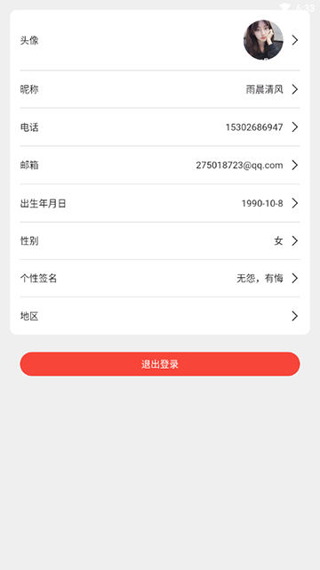
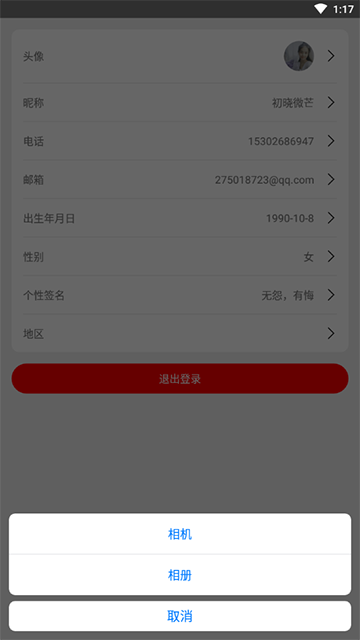
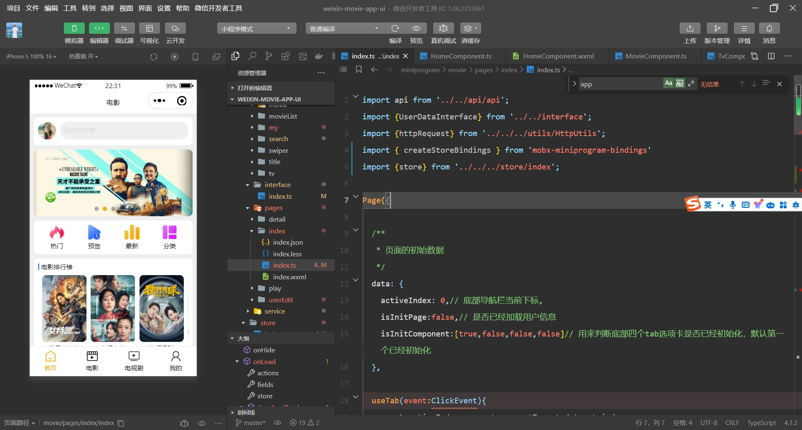

# 微信电影音乐APP

开发者：吴怨吴悔

=============================界面预览（如果无法预览，请查看项目根目录png文件）==========================

=============================界面预览（如果无法预览，请查看项目根目录png文件）==========================

使用ts语言开发，后端接口使用springboot开发，所有电影数据来自于python爬虫程序，爬取第三方电影网站数据

后端接口项目和sql语句：https://github.com/wuyuanwuhui99/springboot-app-service

flutter版本参见: https://github.com/wuyuanwuhui99/flutter-movie-app-ui

react native版本参见: https://github.com/wuyuanwuhui99/react-native-app-ui

harmony鸿蒙版本参见: https://github.com/wuyuanwuhui99/Harmony_movie_app_ui

vue在线音乐项目：https://github.com/wuyuanwuhui99/vue-music-app-ui

在线音乐后端项目：https://github.com/wuyuanwuhui99/koa2-music-app-service

vue3+ts明日头条项目：https://github.com/wuyuanwuhui99/vue3-ts-toutiao-app-ui

音乐播放器正在开发中，音乐数据来自于python爬虫程序，爬取酷狗音乐数据，敬请关注

接口和数据请在本地电脑中，暂时没有购买和部署服务器，仅限本地调试，如有需要调试请联系本人启动外网映射

联系方式：（微信）wuwenqiang_99、（邮箱）275018723@qq.com
